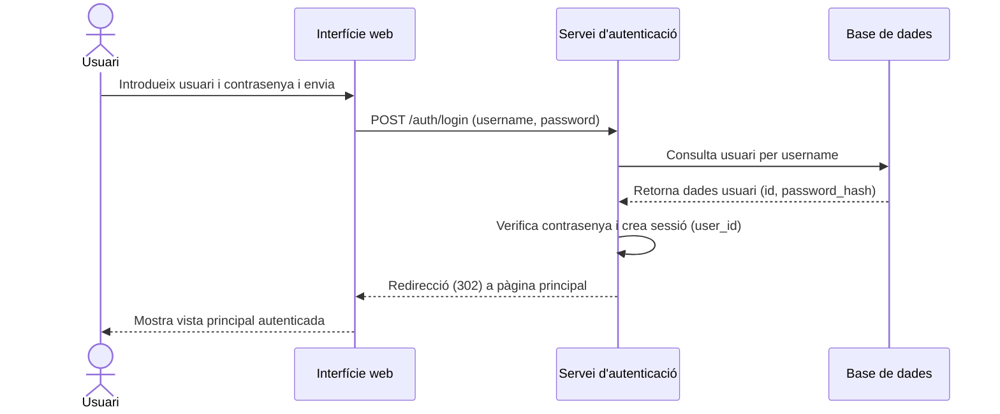
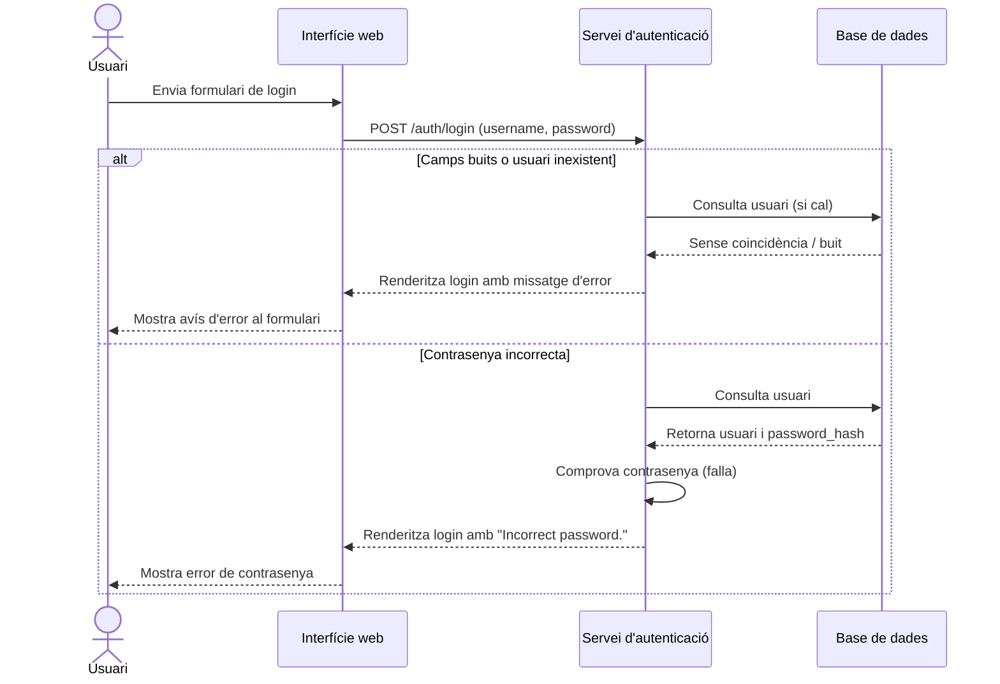

```mermaid
sequenceDiagram
    actor U as Usuari
    participant W as Interfície web
    participant A as Servei d'autenticació
    participant D as Base de dades

    U->>W: Introdueix usuari i contrasenya i envia
    W->>A: POST /auth/login (username, password)
    A->>D: Consulta usuari per username
    D-->>A: Retorna dades usuari (id, password_hash)
    A->>A: Verifica contrasenya i crea sessió (user_id)
    A-->>W: Redirecció (302) a pàgina principal
    W-->>U: Mostra vista principal autenticada
```

```mermaid
sequenceDiagram
    actor U as Usuari
    participant W as Interfície web
    participant A as Servei d'autenticació
    participant D as Base de dades

    U->>W: Envia formulari de login
    W->>A: POST /auth/login (username, password)
    alt Camps buits o usuari inexistent
        A->>D: Consulta usuari (si cal)
        D-->>A: Sense coincidència / buit
        A-->>W: Renderitza login amb missatge d'error
        W-->>U: Mostra avís d'error al formulari
    else Contrasenya incorrecta
        A->>D: Consulta usuari
        D-->>A: Retorna usuari i password_hash
        A->>A: Comprova contrasenya (falla)
        A-->>W: Renderitza login amb "Incorrect password."
        W-->>U: Mostra error de contrasenya
    end

```
